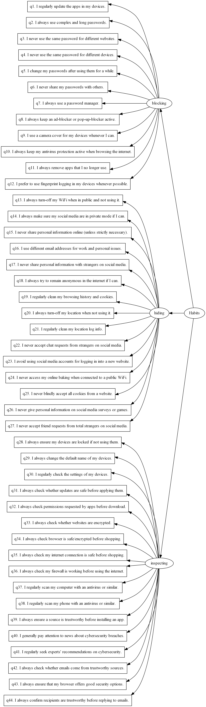
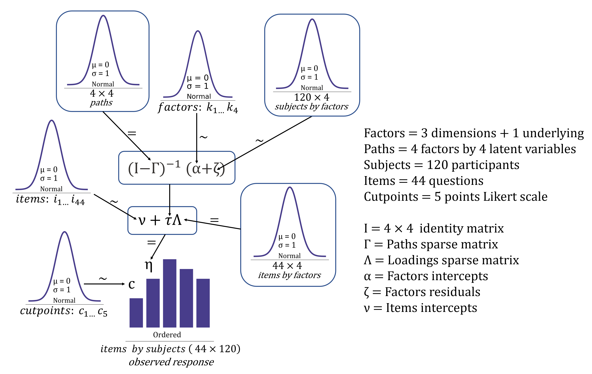
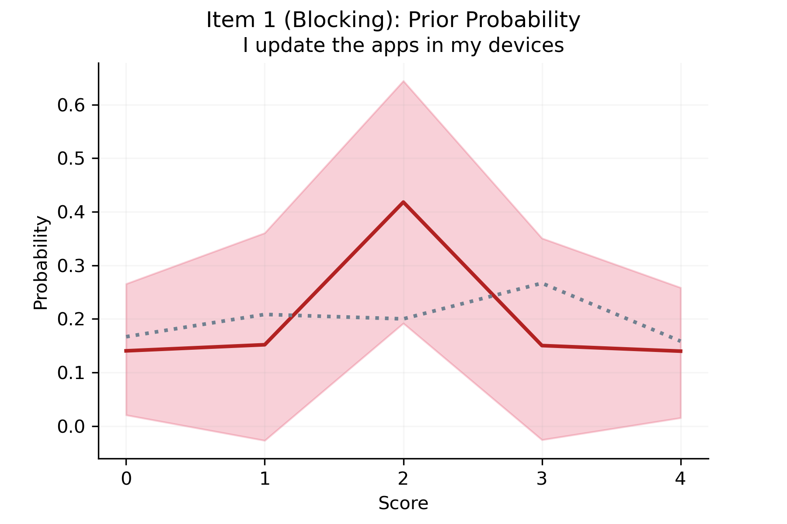
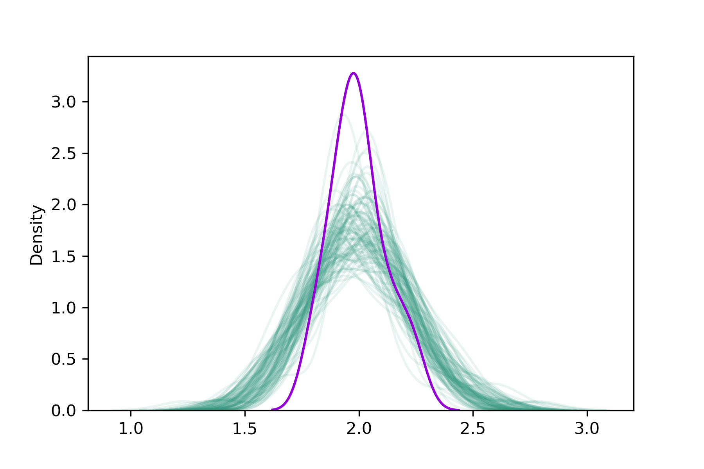
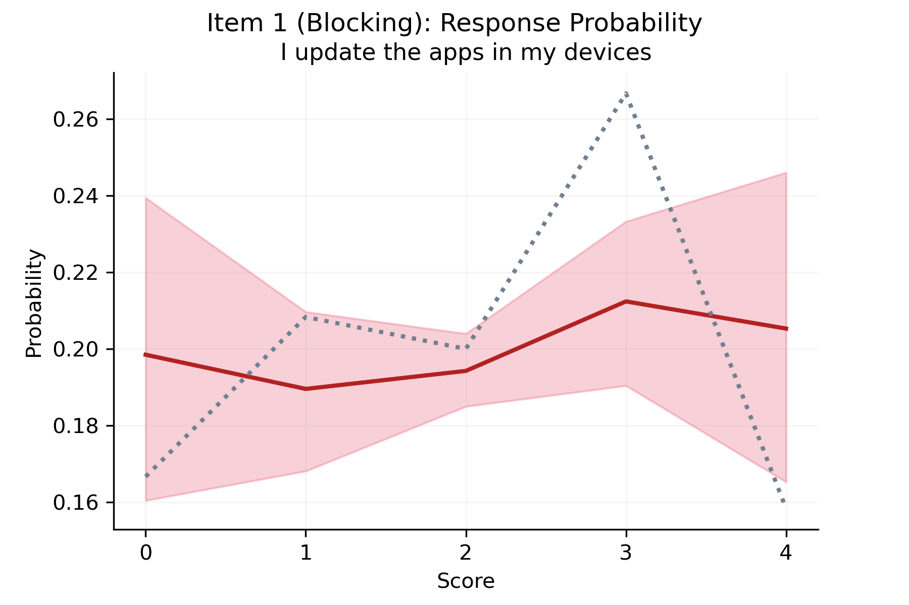

<h1> Precision Analysis </h1>

	The present analysis aims to estimate the ideal sample size for a hierarchical ordered-logistic Bayesian structural equation model (BSEM). This statistical model intends to model a psychometric model with 3 dimensions and 44 items from cybersecurity habits scale (CHS); where each item is rated in a 5-point Likert scale (from 0 to 4). Here, we aim at finding a precision of the expectation, which is in the probability of response to each one of the 44 items. The goal is to reach precisions lower than 10%, where the precision is the width of the 90% highest density interval (HDI). We aim at achieving precisions below 10% for all scores and all items (i.e. 5 scores by 44 items = 220 precisions). To this aim, we simulated random responses and sampled the model twice using these simulate data. We started with 100 simulated participants and immediately followed with 120 participants, which rendered the desired precision. Here we present the results of the second iteration. (Our PyMC3 implementation borrows from this blogpost: https://crackedbassoon.com/writing/bsem-vgen)

<h1> Model </h1>

 The image below shows all 44 items as related to the 3 dimension (blocking, hiding, inspecting) as derived from 1 underlying factor (Habits). 

 After defining this model we designed a statistical model: a hierarchical ordered-logistic BSEM model, detailed in the image below. 

 Before running the model, we ensured that priors were weakly informative but sensible via a prior predictive check. With no specific expectations per item, we placed the greater probability on the median of the Likert scale (2 points). Image below gives an example of prior predictive check probability over item 1 (blocking dimension). 

<h1> Results </h1>

 We simulated responses to each item (44) by 120 articipants (5280 responses total), and sampled the model using Markov chain Monte Carlo (MCMC) No U-turn sampling (NUTS) with 2000 tuning steps, 2000 samples, 4 chains and 0.95 acceptance target. The model sampled well, with R_hat <= 1.01 and R_hat > 0.99;  BFMIs > 0.9, and bulk ESS > 400 for all parameters. Posterior predictive checks are reasonable, but maybe slightly inaccurate, probably due to the randomness of simulated samples. Image below shows the simulated distribution in purple and samples from the posterior in green.  

 Precision analysis achieved the goal with 120 participants, that is no HDI width reached 10%. Image below exemplifies this with item 1 from the blocking dimension. The image shows the expected probability of rating the item at each point of the scale. 

<h1> Conclusion </h1>

 The present analysis proves to be effective and indicates that a sample size of 120 participants or more should be enough for achieving great precision of the estimates. We expect that the precision of loadings and paths would improve with real participants as responses would not be given at random. 
 

